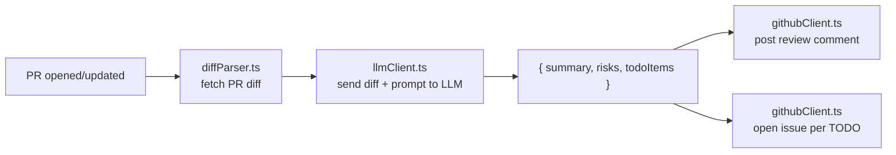

# AI PR-Review Action

Problem: code review bandwidth doesn't scale with team size.

> ⚠️ **Required secret:** this action needs an LLM API key added as a repo secret before its workflows will run. See [Setup](#setup) below. Without it, `Self-Test` and `AI PR Review` fail immediately with `Input required and not supplied: api-key`.

## What it does

On every PR: reads the diff → sends it to an LLM → posts a structured summary comment → opens a GitHub issue for anything flagged as follow-up work.

The LLM's output is parsed into a fixed shape — `{ summary, risks, todoItems }` — rather than dumped into GitHub as raw text, so the comment and the issue-creation logic are both deterministic.

## Architecture

```
ai-pr-review-action/
├── action.yml                  # Action metadata (inputs: api-key, model, etc.)
├── src/
│   ├── index.ts                # entrypoint — wires everything together
│   ├── diffParser.ts           # pulls the PR diff via the GitHub API
│   ├── llmClient.ts            # calls the LLM API, returns structured findings
│   ├── githubClient.ts         # posts the review comment + opens issues
│   └── prompts/
│       └── reviewPrompt.ts     # the exact prompt sent to the model
├── .github/workflows/
│   ├── self-test.yml           # runs the action against a fixture diff on every push
│   ├── pr-review.yml           # runs the action on real pull requests
│   └── ci.yml                  # build/lint/test
├── fixtures/sample-diff.patch  # a synthetic diff used by self-test.yml
└── README.md
```



## Demo

`[MEASURE AFTER BUILD]` — GIF of an actual PR comment + issue being created goes here.

## Setup

1. **Add your LLM provider's API key as a repo secret** — this is the one required step:
   1. Get an API key from your LLM provider (e.g. an [Anthropic API key](https://console.anthropic.com/settings/keys)).
   2. In this repo on GitHub, go to **Settings → Secrets and variables → Actions → New repository secret**.
   3. Name it `ANTHROPIC_API_KEY` (or whatever name you reference in your workflow), paste the key as the value, and click **Add secret**.

   Until this secret exists, every workflow that runs this action — including `Self-Test` and `AI PR Review` in this repo — will fail with `Input required and not supplied: api-key`.

2. Add a workflow like the following (see `.github/workflows/pr-review.yml` in this repo for a working example):

   ```yaml
   name: AI PR Review

   on:
     pull_request:
       types: [opened, synchronize, reopened]

   jobs:
     review:
       runs-on: ubuntu-latest
       permissions:
         contents: read
         pull-requests: write
         issues: write
       steps:
         - uses: actions/checkout@v4
         - uses: your-username/ai-pr-review-action@v1
           with:
             api-key: ${{ secrets.ANTHROPIC_API_KEY }}
   ```

That's it — the action reads `GITHUB_TOKEN` automatically for posting comments and opening issues. The `pull-requests: write` and `issues: write` permissions shown above are required, or the action will fail when it tries to comment or create an issue.

### Inputs

| Input           | Required | Default                                      | Description                                                                 |
| --------------- | -------- | --------------------------------------------- | ----------------------------------------------------------------------------|
| `api-key`       | yes      | —                                              | API key for the LLM provider.                                               |
| `api-url`       | no       | `https://api.anthropic.com/v1/messages`        | LLM endpoint to call.                                                       |
| `model`         | no       | `claude-sonnet-5`                              | Model name to request.                                                      |
| `github-token`  | no       | `${{ github.token }}`                          | Token used to read the diff and post comments/issues.                       |
| `diff-file`     | no       | —                                               | Path to a local diff file to review instead of a live PR (used in self-test). |
| `create-issues` | no       | `true`                                          | Whether to open a GitHub issue for each flagged follow-up item.             |

### Outputs

| Output           | Description                                                        |
| ---------------- | -------------------------------------------------------------------|
| `summary`         | The plain-English review summary.                                 |
| `risks`           | JSON array of risk strings.                                       |
| `todo-items`      | JSON array of follow-up item strings.                              |
| `comment-posted`  | `"true"` if a comment was posted on a PR, `"false"` in self-test mode. |

### Using a different LLM provider

`llmClient.ts` targets Anthropic's [Messages API](https://docs.anthropic.com/en/api/messages) by default: `api-key`/`api-url`/`model` are all configurable inputs, but the request body and response parsing are written for that API's shape. To point this at another provider (OpenAI, a local model server, etc.), update the `fetch` call and the response-extraction logic in `src/llmClient.ts` to match that provider's request/response format — the rest of the action (diff fetching, comment posting, issue creation) is provider-agnostic and doesn't need to change.

## Self-test

`.github/workflows/self-test.yml` runs the action against the committed fixture diff (`fixtures/sample-diff.patch`) on every push to `main`, so you can see the action produce real, structured findings without needing a live PR. It still calls the real LLM API (using the same `ANTHROPIC_API_KEY` secret — see [Setup](#setup) if it isn't set yet), it just skips posting a comment or opening issues since there's no PR to post to.

**Result on the fixture diff:** `[MEASURE AFTER BUILD]` risks and `[MEASURE AFTER BUILD]` follow-up items correctly identified, vs. a 2-minute manual read of the same diff.

## Stack

TypeScript, GitHub Actions Toolkit (`@actions/core`, `@actions/github`), Anthropic Messages API (swappable).
